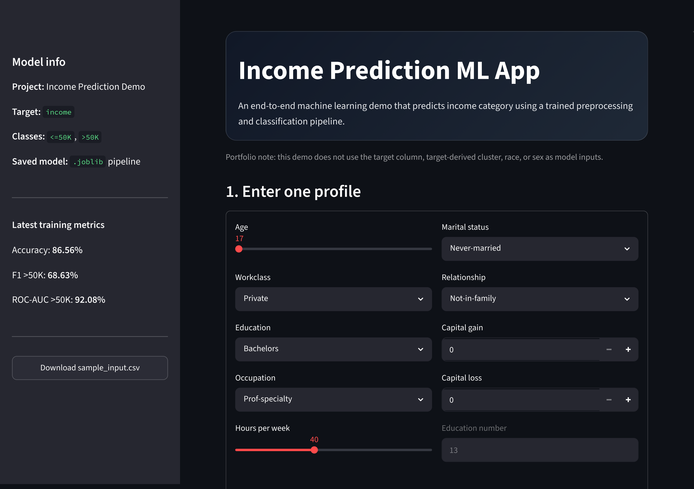
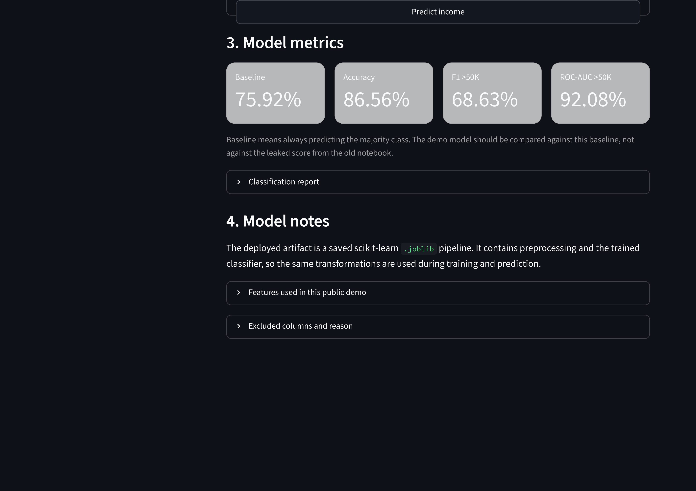
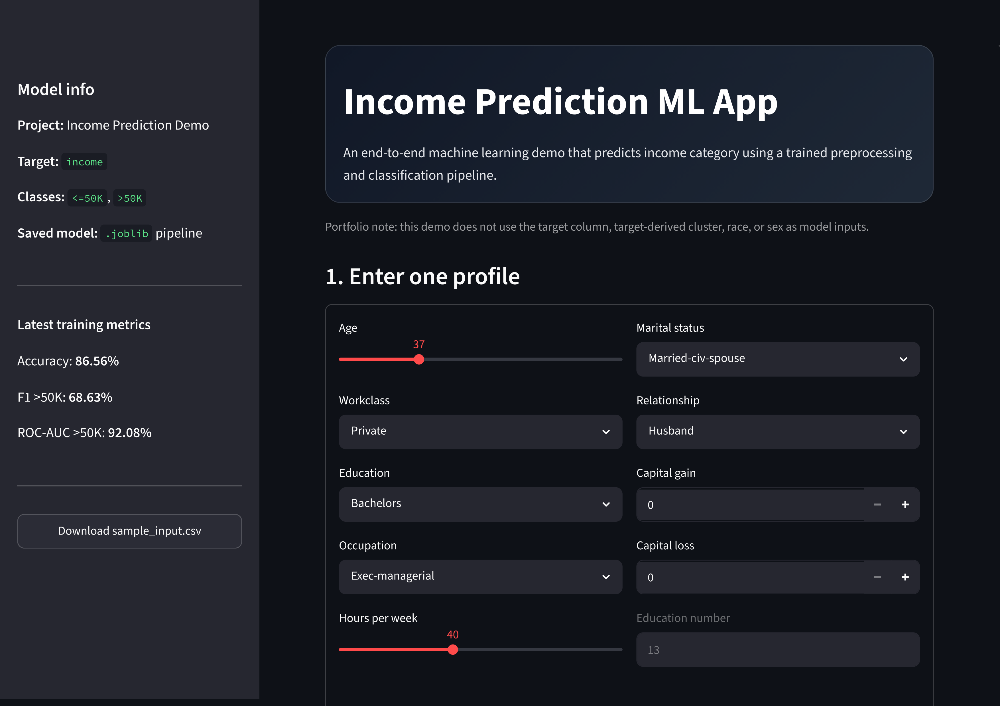
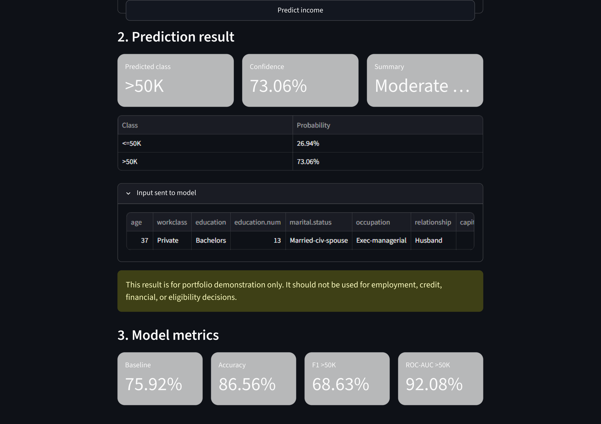
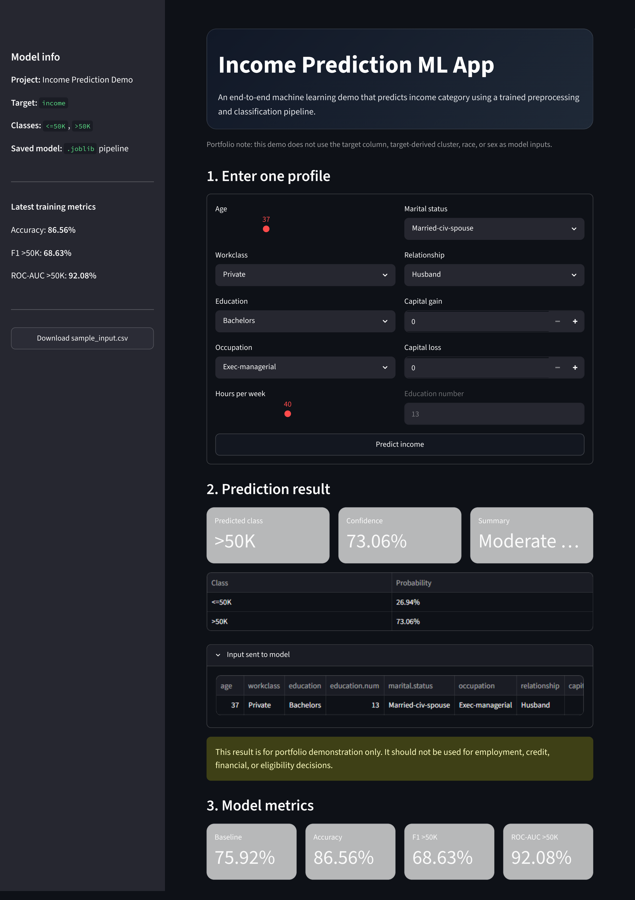
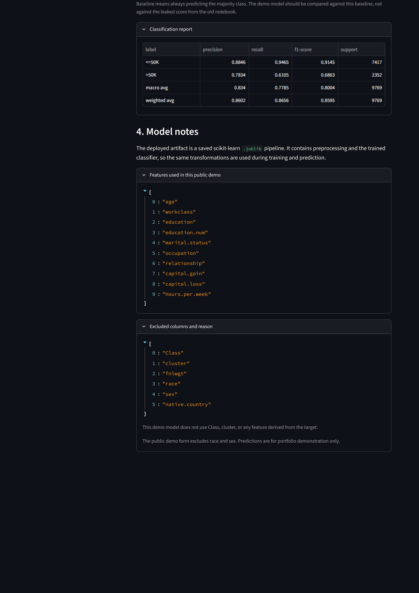

# Income Prediction ML App

[](#)
[](#)
[](#)

An end-to-end machine learning portfolio project that predicts whether a person's income category is likely to be `<=50K` or `>50K` using selected work, education, and weekly-hour attributes.

> **Live demo:** `[PASTE_YOUR_STREAMLIT_APP_URL_HERE](https://income-prediction-ml-app-gw2knwg6cjnnngjwltsp4c.streamlit.app/)`  
> **GitHub repository:** https://github.com/frnqpur/income-prediction-ml-app

---

## Project Overview

This project was prepared as a recruiter-ready machine learning demo. It includes:

- data preprocessing
- feature selection
- trained scikit-learn model pipeline
- saved `.joblib` model artifact
- one-person prediction form
- prediction confidence/probability
- metrics display from `metrics.json`
- deployment-ready Streamlit app

The original notebook was reviewed before preparing this demo. The old notebook result is **not used as the final demo model** because it had a target leakage risk: a `cluster` feature was created from the target column and later used for prediction.

This final app uses a cleaner pipeline and excludes target-derived columns.

---

## Screenshots

### 1. Homepage





### 2. Input Form



### 3. Prediction Result



### 4. Model Metrics





---

## Features

- Single-person prediction form
- Income prediction output: `<=50K` or `>50K`
- Prediction confidence/probability when available
- Model information loaded from `metadata.json`
- Training metrics loaded from `metrics.json`
- Graceful error handling for missing model or metadata files
- Lightweight Streamlit interface
- Deployment-ready structure for Streamlit Community Cloud

---

## Tech Stack

| Area | Tools |
|---|---|
| Language | Python |
| Data Processing | Pandas |
| Machine Learning | scikit-learn |
| Model Persistence | Joblib |
| Web Demo | Streamlit |
| Deployment | Streamlit Community Cloud / Hugging Face Spaces |

---

## Model Pipeline

The app uses a saved scikit-learn `.joblib` pipeline:

```text
artifacts/income_prediction_pipeline.joblib
```

The `.joblib` file stores the trained preprocessing and model pipeline, allowing the app to perform predictions without retraining each time.

Pipeline summary:

```text
Input data
→ preprocessing
→ feature transformation
→ classification model
→ income prediction
```

---

## Features Used by the Model

```text
age
workclass
education
education.num
marital.status
occupation
relationship
capital.gain
capital.loss
hours.per.week
```

---

## Excluded Columns

The demo intentionally does **not** use these columns:

```text
Class
cluster
race
sex
native.country
fnlwgt
```

Reason:

- `Class` is the target column.
- `cluster` was target-derived in the old notebook and could cause leakage.
- `race` and `sex` are excluded from the public demo form.
- `native.country` is excluded to reduce sensitive/proxy feature risk.
- `fnlwgt` is excluded to keep the demo form easier to understand.

---

## Model Metrics

The latest model metrics are stored in:

```text
artifacts/metrics.json
```

Current reported metrics:

| Metric | Score |
|---|---:|
| Accuracy | 86.56% |
| F1-score for `>50K` | 68.63% |
| ROC-AUC for `>50K` | 92.08% |
| Baseline majority accuracy | 75.92% |

These metrics are shown for portfolio demonstration and should not be used for real-world decision-making.

---

## Project Structure

```text
income-prediction-ml-app/
├── app.py
├── train_model.py
├── requirements.txt
├── README.md
├── sample_input.csv
├── artifacts/
│   ├── income_prediction_pipeline.joblib
│   ├── metadata.json
│   └── metrics.json
├── data/
│   ├── adult_dataset.csv
│   └── README.md
├── screenshots/
│   ├── 01-homepage-1.png
│   ├── 01-homepage-2.png
│   ├── 02-input-form.png
│   ├── 03-prediction-result.png
│   ├── 04-model-metrics-1.png
│   ├── 04-model-metrics-2.png
│   └── README.md
└── portfolio-kit/
```

---

## Local Setup

Open terminal in the project folder:

```powershell
cd "YOUR PROJECT DIIRECTORY"
```

Create a virtual environment:

```powershell
python -m venv .venv
```

Activate the virtual environment:

```powershell
.\.venv\Scripts\Activate.ps1
```

If PowerShell blocks activation, run:

```powershell
Set-ExecutionPolicy -Scope Process -ExecutionPolicy Bypass
.\.venv\Scripts\Activate.ps1
```

Install dependencies:

```powershell
python -m pip install --upgrade pip
pip install -r requirements.txt
```

Run the app:

```powershell
streamlit run app.py
```

Open the local URL shown by Streamlit, usually:

```text
http://localhost:8501
```

---

## Retrain the Model

Retraining is only needed if the dataset, feature list, or model logic changes.

```powershell
python train_model.py
```

This regenerates:

```text
artifacts/income_prediction_pipeline.joblib
artifacts/metrics.json
artifacts/metadata.json
```

---

## Demonstrates

This project demonstrates:

- end-to-end ML workflow
- data preprocessing
- model pipeline design
- model artifact management with `.joblib`
- Streamlit app development
- prediction form UX
- deployment preparation
- responsible model documentation

---

## Important Note

This app is for portfolio and learning purposes only. It should not be used for real-world hiring, finance, credit, employment, or access-related decisions.
